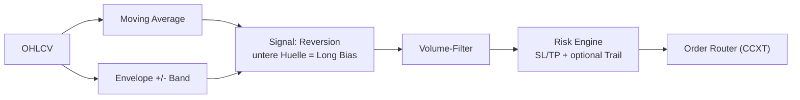

# 📊 LTBBot - Envelope Trading Strategy Bot

<div align="center">


[](https://www.python.org/)
[](https://github.com/ccxt/ccxt)
[](https://optuna.org/)
[](LICENSE)

**Ein hochoptimierter Trading-Bot basierend auf der Envelope-Strategie mit automatischer Parameteroptimierung**

[Features](#-features) • [Installation](#-installation) • [Optimierung](#-optimierung) • [Live-Trading](#-live-trading) • [Monitoring](#-monitoring) • [Wartung](#-wartung)

</div>

---

## 📊 Übersicht

LTBBot ist ein spezialisierter Trading-Bot, der die Envelope-Strategie (Moving Average Envelopes) verwendet, um profitable Trading-Gelegenheiten zu identifizieren. Das System nutzt Optuna zur automatischen Optimierung der Strategie-Parameter und kann mehrere Handelspaare gleichzeitig verwalten.

### 🧭 Trading-Logik (Kurzfassung)
- **Mean-Reversion via Envelopes**: Geht Long bei Rücklauf an die untere Hülle (Reversion zum Mittelwert), reduziert/flat an der oberen; Mittellinie dient als Trend-/Bias-Filter.
- **Volumen-Check**: Trades nur bei Mindestvolumen-Ratio zur Vermeidung illiquider Moves.
- **Risk Layer**: Fester SL/TP + optionaler Trailing-Stop; Positionsgröße abhängig von Risiko je Trade.
- **Optimizer-Loop**: Optuna sucht Envelope-Bandbreiten, MA-Längen und SL/TP-Kombinationen pro Symbol/Timeframe.

### 🔍 Strategie-Visualisierung


### 📈 Trade-Beispiel (TP/SL/Trailing)
- Setup: Preis dippt an die untere Envelope; Volumen ok; MA-Slope leicht steigend.
- Entry: Long an der unteren Hülle.
- Initial SL: Unter letztem Swing-Low oder unter der unteren Hülle - x% Puffer.
- TP: Rückkehr zur Mittellinie oder obere Hülle (konservativ/aggressiv wählbar).
- Trailing: Nach Erreichen der Mittellinie Trail unter das letzte Higher Low ziehen; lässt Ausdehnung bis zur oberen Hülle zu.

Architektur-Skizze:
```
OHLCV → Envelope-Engine → Signal (Long/Flat) → Risk Engine → Order Router (CCXT)
             ↘ Optuna (Bands, SL/TP, MA) ↗
```

### 🎯 Hauptmerkmale

- **📈 Envelope Strategy**: Professionelle Envelope-basierte Trading-Strategie
- **🔧 Auto-Optimization**: Vollautomatische Parameteroptimierung mit Optuna
- **💰 Multi-Asset**: Handel mehrerer Kryptowährungspaare gleichzeitig
- **⚡ Optimized**: Fokus auf Performance und Effizienz
- **📊 Advanced Analytics**: Umfassende Backtest- und Performance-Analysen
- **🛡️ Risk Management**: Integrierte Risk-Management-Tools
- **🔔 Notifications**: Telegram-Benachrichtigungen für Trading-Events

---

## 🚀 Features

### Trading Features
- ✅ Envelope-basierte Ein- und Ausstiegssignale
- ✅ Multiple Timeframes (5m, 15m, 30m, 1h, 2h, 4h, 6h, 1d)
- ✅ Unterstützt BTC, ETH, SOL, DOGE und weitere Altcoins
- ✅ Dynamisches Position Sizing
- ✅ Stop-Loss und Take-Profit Management
- ✅ Automatische Trade-Verwaltung

### Technical Features
- ✅ Optuna Hyperparameter-Optimierung
- ✅ Moving Average Envelope Indikatoren
- ✅ Volume-basierte Filter
- ✅ Backtesting mit realistischer Slippage
- ✅ Walk-Forward-Analyse
- ✅ Feature-Engineering

---

## 📋 Systemanforderungen

### Hardware
- **CPU**: Multi-Core Prozessor empfohlen
- **RAM**: Minimum 2GB, empfohlen 4GB+
- **Speicher**: 1GB freier Speicherplatz

### Software
- **OS**: Linux (Ubuntu 20.04+), macOS, Windows 10/11
- **Python**: Version 3.8 oder höher
- **Git**: Für Repository-Verwaltung

---

## 💻 Installation

### 1. Repository klonen

```bash
git clone https://github.com/Youra82/ltbbot.git
cd ltbbot
```

### 2. Automatische Installation

```bash
# Linux/macOS
chmod +x install.sh
./install.sh

# Windows (PowerShell)
python -m venv .venv
.venv\Scripts\activate
pip install -r requirements.txt
```

Das Installations-Script:
- ✅ Erstellt virtuelle Python-Umgebung (`.venv`)
- ✅ Installiert alle Dependencies
- ✅ Erstellt Verzeichnisse (`data/`, `logs/`, `artifacts/`)
- ✅ Initialisiert Konfigurationsdateien

### 3. API-Credentials konfigurieren

Erstelle `secret.json` im Root-Verzeichnis:

```json
{
  "ltbbot": [
    {
      "name": "Binance Account",
      "exchange": "binance",
      "apiKey": "DEIN_API_KEY",
      "secret": "DEIN_SECRET_KEY",
      "options": {
        "defaultType": "future"
      }
    }
  ]
}
```

⚠️ **Sicherheitshinweise**:
- Niemals `secret.json` committen!
- Nur API-Keys mit Trading-Rechten (keine Withdrawals)
- IP-Whitelist aktivieren
- 2FA auf Exchange-Account aktivieren

### 4. Trading-Strategien konfigurieren

Bearbeite `settings.json`:

```json
{
  "live_trading_settings": {
    "use_auto_optimizer_results": false,
    "active_strategies": [
      {
        "symbol": "BTC/USDT:USDT",
        "timeframe": "1d",
        "active": true
      },
      {
        "symbol": "SOL/USDT:USDT",
        "timeframe": "30m",
        "active": true
      }
    ]
  }
}
```

**Parameter**:
- `symbol`: Handelspaar (Format: BASE/QUOTE:SETTLE)
- `timeframe`: Zeitrahmen für Kerzen
- `active`: Strategie aktiv/inaktiv

---

## 🎯 Optimierung & Training

### Vollständige Pipeline (Empfohlen)

```bash
# Interaktives Optimierungs-Script
./run_pipeline.sh
```

Das Pipeline-Script führt durch:

1. **Aufräumen** (Optional): Löscht alte Konfigurationen
2. **Symbol-Auswahl**: Interaktive Auswahl der Handelspaare
3. **Timeframe-Auswahl**: Wähle Zeitrahmen für jedes Paar
4. **Daten-Download**: Lädt historische OHLCV-Daten
5. **Optimierung**: Findet beste Parameter mit Optuna
6. **Backtest**: Validiert Strategien
7. **Config-Generierung**: Erstellt Konfigs für Live-Trading

### Manuelle Optimierung

```bash
source .venv/bin/activate

# Optimierung starten
python src/ltbbot/analysis/optimizer.py
```

**Optionen**:
```bash
# Spezifische Symbole
python src/ltbbot/analysis/optimizer.py --symbols BTC ETH SOL

# Custom Timeframes
python src/ltbbot/analysis/optimizer.py --timeframes 30m 1h 4h

# Mehr Optimierungs-Trials
python src/ltbbot/analysis/optimizer.py --trials 300

# Walk-Forward Analyse
python src/ltbbot/analysis/optimizer.py --walk-forward
```

**Optimierte Parameter**:
- Moving Average Perioden
- Envelope Prozentsätze
- Stop-Loss/Take-Profit Levels
- Position Sizing Parameter

### Optimierungsergebnisse

Nach der Optimierung:
- Konfigs in `src/ltbbot/strategy/configs/config_SYMBOL_envelope.json`
- Optimierungsergebnisse in `artifacts/results/`
- Backtest-Berichte in `artifacts/backtest/`

---

## 🔴 Live Trading

### Start des Live-Trading

```bash
# Master Runner starten
python master_runner.py
```

### Manuell starten / Cronjob testen
Sofortige Ausführung ohne 15-Minuten-Cron-Intervall:

```bash
cd /home/ubuntu/ltbbot && /home/ubuntu/ltbbot/.venv/bin/python3 /home/ubuntu/ltbbot/master_runner.py
```

Der Master Runner:
- ✅ Lädt alle aktiven Strategien aus `settings.json`
- ✅ Startet separate Prozesse für jedes Handelspaar
- ✅ Überwacht Kontostand und Kapital
- ✅ Verwaltet Positionen und Orders
- ✅ Führt detailliertes Logging

### Automatischer Start mit Pipeline

```bash
# Optimierung + Live-Trading in einem Schritt
./run_pipeline_automated.sh
```

Führt automatisch aus:
1. Neue Optimierung
2. Backtest-Validierung
3. Live-Trading Start

### Als Systemd Service (Linux)

```bash
# Service-Datei erstellen
sudo nano /etc/systemd/system/ltbbot.service
```

```ini
[Unit]
Description=LTBBot Trading System
After=network.target

[Service]
Type=simple
User=your-user
WorkingDirectory=/path/to/ltbbot
ExecStart=/path/to/ltbbot/.venv/bin/python master_runner.py
Restart=always
RestartSec=10

[Install]
WantedBy=multi-user.target
```

```bash
# Service aktivieren und starten
sudo systemctl enable ltbbot
sudo systemctl start ltbbot
sudo systemctl status ltbbot
```

---

## 📊 Monitoring & Status

### Status-Dashboard

```bash
# Vollständiger Status
./show_status.sh
```

Zeigt:
- 📊 Aktuelle Konfiguration
- 📈 Offene Positionen
- 💰 Kontostand
- 📝 Recent Logs

### Performance-Monitoring

```bash
# Performance anzeigen
python show_performance.py

# Ergebnisse anzeigen
./show_results.sh

# Charts generieren
./show_chart.sh
```

### Equity-Curve Charts

```bash
# Chart generieren und anzeigen
./show_chart.sh

# Chart per Telegram senden
python generate_and_send_chart.py
```

### Log-Files überwachen

```bash
# Live-Trading Logs
tail -f logs/live_trading_*.log

# Fehler-Logs
tail -f logs/error_*.log

# Spezifisches Symbol
grep "BTC/USDT" logs/*.log

# Nur Trades
grep -i "opened position\|closed position" logs/*.log
```

### Analysis-Summaries

Das System erstellt automatisch CSV-Summaries:
- `single_analysis_summary_YYYY-MM-DD.csv`

```bash
# Letzte Summary anzeigen
cat single_analysis_summary_*.csv | tail -20
```

---

## 🛠️ Wartung & Pflege

### Regelmäßige Wartung

#### 1. Updates installieren

```bash
# Automatisches Update
./update.sh
```

Das Update-Script:
- ✅ Pulled Git-Changes
- ✅ Updated Dependencies
- ✅ Migriert Konfigurationen
- ✅ Führt Tests aus

#### 2. Log-Rotation

```bash
# Alte Logs komprimieren (>30 Tage)
find logs/ -name "*.log" -type f -mtime +30 -exec gzip {} \;

# Archivierte Logs löschen (>90 Tage)
find logs/ -name "*.log.gz" -type f -mtime +90 -delete
```

#### 3. Performance-Check

```bash
# Regelmäßig Performance prüfen
python show_performance.py

# Trade-History analysieren
cat logs/trades_*.log | grep "Profit:" | awk '{sum+=$NF} END {print sum}'
```

### Vollständiges Aufräumen

#### Konfigurationen zurücksetzen

```bash
# Generierte Envelope-Configs löschen
rm -f src/ltbbot/strategy/configs/config_*_envelope.json

# Prüfen
ls -la src/ltbbot/strategy/configs/

# Optimierungsergebnisse löschen
rm -rf artifacts/results/*

# Verification
ls -la artifacts/results/
```

#### Cache und Daten löschen

```bash
# Heruntergeladene Marktdaten
rm -rf data/raw/*
rm -rf data/processed/*

# Backtest-Cache
rm -rf data/backtest_cache/*

# Prüfen
du -sh data/*
```

#### Kompletter Neustart

```bash
# Backup erstellen
tar -czf ltbbot_backup_$(date +%Y%m%d).tar.gz \
    secret.json settings.json artifacts/ logs/

# Alles zurücksetzen
rm -rf artifacts/* data/* logs/*
mkdir -p artifacts/{results,backtest} data/{raw,processed} logs/

# Re-Installation
./install.sh

# Konfiguration wiederherstellen
cp settings.json.backup settings.json
```

### Tests ausführen

```bash
# Alle Tests
./run_tests.sh

# Spezifische Tests
pytest tests/test_envelope_strategy.py
pytest tests/test_exchange.py -v

# Mit Coverage
pytest --cov=src tests/
```

---

## 🔧 Nützliche Befehle

### Konfiguration

```bash
# Settings validieren
python -c "import json; print(json.load(open('settings.json')))"

# Envelope-Configs auflisten
ls -lh src/ltbbot/strategy/configs/config_*_envelope.json

# Config-Inhalt anzeigen
cat src/ltbbot/strategy/configs/config_BTC_30m_envelope.json | python -m json.tool
```

### Prozess-Management

```bash
# Laufende Prozesse finden
ps aux | grep python | grep ltbbot

# Master Runner PID
pgrep -f "python.*master_runner"

# Sauber beenden
pkill -f master_runner.py

# Erzwungen beenden
pkill -9 -f master_runner.py

# Alle ltbbot-Prozesse
pkill -f ltbbot
```

### Exchange-Verbindung testen

```bash
# API-Verbindung prüfen
python -c "from src.ltbbot.utils.exchange import Exchange; \
    e = Exchange('binance'); print(e.fetch_balance())"

# Marktdaten abrufen
python -c "from src.ltbbot.utils.exchange import Exchange; \
    e = Exchange('binance'); \
    print(e.fetch_ohlcv('BTC/USDT:USDT', '1h', limit=10))"

# Offene Positionen
python -c "from src.ltbbot.utils.exchange import Exchange; \
    e = Exchange('binance'); print(e.fetch_positions())"
```

### Performance-Analyse

```bash
# Equity-Curves vergleichen
python -c "
import pandas as pd
manual = pd.read_csv('manual_portfolio_equity.csv')
optimal = pd.read_csv('optimal_portfolio_equity.csv')
print('Manual ROI:', (manual['equity'].iloc[-1] / manual['equity'].iloc[0] - 1) * 100, '%')
print('Optimal ROI:', (optimal['equity'].iloc[-1] / optimal['equity'].iloc[0] - 1) * 100, '%')
"

# Backtest-Ergebnisse analysieren
find artifacts/backtest/ -name "*.json" -exec cat {} \; | python -m json.tool
```

### Debugging

```bash
# Debug-Modus aktivieren
export LTBBOT_DEBUG=1
python master_runner.py

# Strategie-Signale verfolgen
tail -f logs/live_trading_*.log | grep -i "signal\|buy\|sell"

# Mit Python Debugger
python -m pdb src/ltbbot/strategy/run.py
```

---

## 📂 Projekt-Struktur

```
ltbbot/
├── src/
│   └── ltbbot/
│       ├── analysis/              # Optimierung & Analyse
│       │   └── optimizer.py
│       ├── strategy/              # Trading-Strategie
│       │   ├── run.py
│       │   ├── envelope_strategy.py
│       │   └── configs/           # Generierte Configs
│       ├── backtest/              # Backtesting
│       │   └── backtester.py
│       └── utils/                 # Utilities
│           ├── exchange.py
│           └── indicators.py
├── tests/                         # Unit-Tests
├── data/                          # Marktdaten
│   ├── raw/
│   └── processed/
├── logs/                          # Log-Files
├── artifacts/                     # Ergebnisse
│   ├── results/                   # Optimierungsergebnisse
│   └── backtest/                  # Backtest-Berichte
├── master_runner.py              # Main Entry-Point
├── settings.json                 # Haupt-Konfiguration
├── secret.json                   # API-Credentials
└── requirements.txt              # Python-Dependencies
```

---

## ⚠️ Wichtige Hinweise

### Risiko-Disclaimer

⚠️ **Kryptowährungs-Trading ist hochriskant!**

- Nur Geld einsetzen, dessen Verlust Sie verkraften können
- Keine Gewinn-Garantien
- Vergangene Performance ≠ Zukünftige Ergebnisse
- Umfangreiches Testing empfohlen
- Mit kleinen Beträgen starten

### Security Best Practices

- 🔐 Niemals API-Keys mit Withdrawal-Rechten
- 🔐 IP-Whitelist aktivieren
- 🔐 2FA für Exchange-Account
- 🔐 `secret.json` in `.gitignore`
- 🔐 Regelmäßige Security-Updates

### Performance-Tipps

- 💡 Starten Sie mit 1-2 Handelspaaren
- 💡 Längere Timeframes = Stabilere Signale
- 💡 Regelmäßige Re-Optimierung (alle 2-4 Wochen)
- 💡 Monitoring ist essentiell
- 💡 Backtest vor Live-Trading

---

## 🤝 Support

### Bei Problemen

1. Logs prüfen: `logs/`
2. Tests ausführen: `./run_tests.sh`
3. GitHub Issue mit:
   - Problembeschreibung
   - Log-Auszüge
   - System-Info
   - Reproduktions-Schritte

### Updates

```bash
# Updates prüfen
git fetch origin
git status

# Installieren
./update.sh
```

---

## 📜 Lizenz

MIT License - siehe [LICENSE](LICENSE)

---

## 🙏 Credits

- [CCXT](https://github.com/ccxt/ccxt) - Exchange Integration
- [Optuna](https://optuna.org/) - Hyperparameter Optimization
- [Pandas](https://pandas.pydata.org/) - Data Analysis
- [TA-Lib](https://github.com/mrjbq7/ta-lib) - Technical Analysis

---

<div align="center">

**Made with ❤️ for Algorithmic Trading**

⭐ Star this repo if you find it useful!

[🔝 Nach oben](#-ltbbot---envelope-trading-strategy-bot)

</div>
