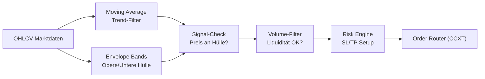

# 📊 LTBBot - Envelope Trading Strategy Bot

<div align="center">


[](https://www.python.org/)
[](https://github.com/ccxt/ccxt)
[](LICENSE)

**Ein hochoptimierter Trading-Bot basierend auf der Envelope-Strategie mit Mean-Reversion und automatischer Parameteroptimierung**

[Features](#-features) • [Installation](#-installation) • [Konfiguration](#-konfiguration) • [Live-Trading](#-live-trading) • [Pipeline](#-interaktives-pipeline-script) • [Monitoring](#-monitoring--status) • [Wartung](#-wartung)

</div>

---

## 📊 Übersicht

LTBBot ist ein spezialisierter Trading-Bot, der die Envelope-Strategie (Moving Average Envelopes) verwendet, um profitable Trading-Gelegenheiten durch Mean-Reversion zu identifizieren. Das System nutzt automatische Parameter-Optimierung und kann mehrere Handelspaare gleichzeitig verwalten.

### 🧭 Trading-Logik (Kurzfassung)
- **Mean-Reversion via Envelopes**: Geht Long bei Rücklauf an die untere Hülle (Reversion zum Mittelwert), reduziert/flacht an der oberen Hülle
- **Mittellinie als Bias-Filter**: Moving Average dient als Trend-Filter (Long nur wenn MA steigt)
- **Volumen-Check**: Trades nur bei Mindestvolumen-Ratio zur Vermeidung illiquider Moves
- **Risk Layer**: Fester Stop-Loss/Take-Profit + optionaler Trailing-Stop; Positionsgröße abhängig von Risiko je Trade
- **Optimizer-Loop**: Automatische Suche nach optimalen Envelope-Bandbreiten, MA-Längen und SL/TP-Kombinationen
- **Execution**: CCXT für Order-Platzierung mit realistischer Slippage-Simulation

### 🔍 Strategie-Visualisierung


### 📈 Trade-Beispiel (Entry/SL/TP)
- **Setup**: Preis dippt an die untere Envelope; Volumen ok; MA-Slope leicht steigend (Uptrend-Filter)
- **Entry**: Long an der unteren Hülle mit Telegram-Alert
- **Initial SL**: Unter letztem Swing-Low oder unter der unteren Hülle - x% Puffer
- **TP**: Rückkehr zur Mittellinie oder obere Hülle (konservativ/aggressiv wählbar)
- **Trailing**: Nach Erreichen der Mittellinie Trail unter das letzte Higher Low nachziehen; lässt Ausdehnung bis zur oberen Hülle zu

---

## 🚀 Features

### Trading Features
- ✅ Envelope-basierte Ein- und Ausstiegssignale
- ✅ Unterstützt mehrere Kryptowährungspaare (BTC, ETH, SOL, DOGE, etc.)
- ✅ Flexible Timeframe-Unterstützung (15m, 30m, 1h, 4h, 1d)
- ✅ Automatische Positionsgröße basierend auf verfügbarem Kapital
- ✅ Volumen-basierte Filter für höhere Signal-Qualität
- ✅ Fester Stop-Loss und Take-Profit Management
- ✅ Telegram-Benachrichtigungen bei neuen Signalen und Trades

### Technical Features
- ✅ CCXT Integration für mehrere Börsen
- ✅ Moving Average Envelope Indikatoren
- ✅ Optuna Hyperparameter-Optimierung
- ✅ Backtesting mit realistischer Slippage-Simulation
- ✅ Robust Error-Handling und Logging
- ✅ Walk-Forward-Analyse für robuste Parameter

---

## 📋 Systemanforderungen

### Hardware
- **CPU**: Multi-Core Prozessor (Intel i5 oder besser empfohlen)
- **RAM**: Minimum 2GB, empfohlen 4GB+
- **Speicher**: 1GB freier Speicherplatz

### Software
- **OS**: Linux (Ubuntu 20.04+), macOS, Windows 10/11
- **Python**: Version 3.8 oder höher
- **Git**: Für Repository-Verwaltung

---

## 💻 Installation

### 1. Repository klonen

```bash
git clone https://github.com/Youra82/ltbbot.git
cd ltbbot
```

### 2. Automatische Installation (empfohlen)

```bash
# Linux/macOS
chmod +x install.sh
./install.sh

# Windows (PowerShell)
python -m venv .venv
.venv\Scripts\activate
pip install -r requirements.txt
```

Das Installations-Script führt folgende Schritte aus:
- ✅ Erstellt eine virtuelle Python-Umgebung (`.venv`)
- ✅ Installiert alle erforderlichen Abhängigkeiten
- ✅ Erstellt notwendige Verzeichnisse (`data/`, `logs/`, `artifacts/`)
- ✅ Initialisiert Konfigurationsdateien

### 3. API-Credentials konfigurieren

Erstelle eine `secret.json` Datei im Root-Verzeichnis:

```json
{
  "ltbbot": [
    {
      "name": "Binance Trading Account",
      "exchange": "binance",
      "apiKey": "DEIN_API_KEY",
      "secret": "DEIN_SECRET_KEY",
      "options": {
        "defaultType": "future"
      }
    }
  ]
}
```

⚠️ **Wichtig**: 
- Niemals `secret.json` committen oder teilen!
- Verwende nur API-Keys mit eingeschränkten Rechten (Nur Trading, keine Withdrawals)
- Aktiviere IP-Whitelist auf der Exchange

### 4. Trading-Strategien konfigurieren

Bearbeite `settings.json` für deine gewünschten Handelspaare:

```json
{
  "live_trading_settings": {
    "active_strategies": [
      {
        "symbol": "BTC/USDT:USDT",
        "timeframe": "4h",
        "use_envelope_bands": true,
        "active": true
      },
      {
        "symbol": "ETH/USDT:USDT",
        "timeframe": "1h",
        "use_envelope_bands": true,
        "active": true
      }
    ]
  }
}
```

**Parameter-Erklärung**:
- `symbol`: Handelspaar (Format: BASE/QUOTE:SETTLE)
- `timeframe`: Zeitrahmen (15m, 30m, 1h, 4h, 1d)
- `use_envelope_bands`: Envelope-Filter aktivieren (true/false)
- `active`: Strategie aktiv (true/false)

---

## 🔴 Live Trading

### Start des Live-Trading

```bash
# Master Runner starten (verwaltet alle aktiven Strategien)
python master_runner.py
```

### Manuell starten / Cronjob testen
Ausführung sofort anstoßen (ohne auf den 15-Minuten-Cron zu warten):

```bash
cd /home/ubuntu/ltbbot && /home/ubuntu/ltbbot/.venv/bin/python3 /home/ubuntu/ltbbot/master_runner.py
```

Der Master Runner:
- ✅ Lädt Konfigurationen aus `settings.json`
- ✅ Startet separate Prozesse für jede aktive Strategie
- ✅ Generiert Envelope-basierte Signale
- ✅ Überwacht Kontostand und verfügbares Kapital
- ✅ Managed Positionen und Risk-Limits
- ✅ Loggt alle Trading-Aktivitäten
- ✅ Sendet Telegram-Benachrichtigungen

### Automatischer Start (Produktions-Setup)

Richte den automatischen Prozess für den Live-Handel ein.

```bash
crontab -e
```

Füge die folgende **eine Zeile** am Ende der Datei ein. Passe den Pfad an, falls dein Bot nicht unter `/home/ubuntu/ltbbot` liegt.

```
# Starte den LTBBot Master-Runner alle 15 Minuten
*/15 * * * * /usr/bin/flock -n /home/ubuntu/ltbbot/ltbbot.lock /bin/sh -c "cd /home/ubuntu/ltbbot && /home/ubuntu/ltbbot/.venv/bin/python3 /home/ubuntu/ltbbot/master_runner.py >> /home/ubuntu/ltbbot/logs/cron.log 2>&1"
```

*(Hinweis: `flock` ist eine gute Ergänzung, um Überlappungen zu verhindern, aber für den Start nicht zwingend notwendig.)*

Logverzeichnis anlegen:

```bash
mkdir -p /home/ubuntu/ltbbot/logs
```


---

## 📊 Interaktives Pipeline-Script

Das **`run_pipeline.sh`** Script automatisiert die Parameter-Optimierung für deine Handelsstrategien. Es führt einen Grid-Search über alle Envelope- und MA-Parameter durch und findet die optimalen Einstellungen für dein ausgewähltes Symbol und Timeframe.

### Features des Pipeline-Scripts

✅ **Interaktive Eingabe** - Einfache Menü-Navigation  
✅ **Automatische Datumswahl** - Zeitrahmen-basierte Lookback-Berechnung  
✅ **Optuna-Optimierung** - Bayessche Hyperparameter-Suche  
✅ **Ladebalken** - Visueller Fortschritt  
✅ **Batch-Optimierung** - Mehrere Symbol/Timeframe-Kombinationen  
✅ **Automatisches Speichern** - Optimale Konfigurationen als JSON  
✅ **Integrierte Backtests** - Sofort nach Optimierung testen  

### Verwendung

```bash
# Pipeline starten
chmod +x run_pipeline.sh
./run_pipeline.sh
```

### Interaktive Eingaben

Das Script fragt dich nach folgende Informationen:

#### 1. Symbol eingeben
```
Welche(s) Symbol(e) möchtest du optimieren?
(z.B. BTC oder: BTC ETH SOL)
> BTC
```

#### 2. Timeframe eingeben
```
Welche(s) Timeframe(s)?
(z.B. 1d oder: 1d 4h 1h)
> 1d
```

#### 3. Startdatum eingeben
```
Startdatum (YYYY-MM-DD oder 'a' für automatisch)?
Automatische Optionen pro Timeframe:
  5m/15m    → 60 Tage Lookback
  30m/1h    → 180 Tage Lookback
  4h/2h     → 365 Tage Lookback
  6h/1d     → 730 Tage Lookback
> a
```

#### 4. Startkapital eingeben
```
Mit wieviel USD starten? (Standard: 100)
> 100
```

### Optimierte Konfigurationen

Nach erfolgreicher Optimierung werden die besten Parameter gespeichert:

```
artifacts/optimal_configs/
├── optimal_BTCUSDT_1d.json
├── optimal_BTCUSDT_4h.json
├── optimal_ETHUSDT_1d.json
└── optimal_ETHUSDT_4h.json
```

**Beispiel-Konfiguration** (`optimal_BTCUSDT_1d.json`):

```json
{
  "symbol": "BTCUSDT",
  "timeframe": "1d",
  "parameters": {
    "ma_period": 20,
    "envelope_std": 2.0,
    "volume_threshold": 1.2,
    "sl_percent": 2.0,
    "tp_percent": 3.0
  },
  "performance": {
    "total_return": 5.25,
    "win_rate": 65.0,
    "num_trades": 20,
    "max_drawdown": -6.15,
    "end_capital": 605.25
  },
  "timestamp": "2025-01-01T20:17:35.833000"
}
```

### Integration mit Live-Trading

Die optimierten Konfigurationen werden **automatisch geladen**:

```bash
./show_results.sh
```

Das Script lädt die optimalen Parameter:
- ✅ Bessere Ergebnisse durch optimierte Parameter
- ✅ Konsistente Strategie-Ausführung
- ✅ Einfaches A/B-Testing

---

## 📊 Monitoring & Status

### Status-Dashboard

```bash
# Einmalig ausführbar machen
chmod +x show_status.sh

# Status anzeigen
./show_status.sh
```

### Trading-Ergebnisse anzeigen

```bash
# Einmalig ausführbar machen
chmod +x show_results.sh

# Ergebnisse anzeigen
./show_results.sh
```

**Angezeigt**:
- 📊 Aktuelle Konfiguration
- 🔐 API-Status
- 📈 Offene Positionen
- 💰 Kontostand
- 📝 Letzte Logs

### Log-Files

```bash
# Live-Trading Logs
tail -f logs/cron.log

# Fehler-Logs
tail -f logs/error.log

# Strategie-Logs
tail -n 100 logs/ltbbot_BTCUSDTUSDT_4h.log
```

### Performance-Metriken

```bash
# Trade-Analyse
python analyze_real_trades_detailed.py

# Vergleich Backtest vs. Live
python compare_real_vs_backtest.py
```

---

## 🛠️ Wartung & Pflege

### Tägliche Verwaltung

#### Logs ansehen

```bash
# Logs live mitverfolgen
tail -f logs/cron.log

# Letzten 200 Zeilen anzeigen
tail -n 200 logs/cron.log

# Nach Fehlern durchsuchen
grep -i "ERROR" logs/cron.log
```

#### Cronjob manuell testen

```bash
cd /home/ubuntu/ltbbot && /home/ubuntu/ltbbot/.venv/bin/python3 /home/ubuntu/ltbbot/master_runner.py
```

### 🔧 Config-Management

#### Konfigurationsdateien löschen

Bei Bedarf können alle generierten Konfigurationen gelöscht werden:

```bash
rm -f src/ltbbot/strategy/configs/config_*.json
```

#### Löschung verifizieren

```bash
ls -la src/ltbbot/strategy/configs/config_*.json 2>&1 || echo "✅ Alle Konfigurationsdateien wurden gelöscht"
```

### Bot aktualisieren

```bash
chmod +x update.sh
bash ./update.sh
```


### Tests ausführen

```bash
# Alle Tests
./run_tests.sh

# Spezifische Tests
pytest tests/test_strategy.py
pytest tests/test_envelope.py -v

# Mit Coverage
pytest --cov=src tests/
```

---

## 🔄 Auto-Optimizer Verwaltung

Der Bot verfügt über einen automatischen Optimizer, der wöchentlich die besten Parameter für alle aktiven Strategien sucht.

### Optimizer manuell triggern

Um eine sofortige Optimierung zu starten (ignoriert das Zeitintervall):

```bash
# Letzten Optimierungszeitpunkt löschen (erzwingt Neustart)
rm ~/ltbbot/data/cache/.last_optimization_run

# Master Runner starten (prüft ob Optimierung fällig ist)
cd ~/ltbbot && .venv/bin/python3 master_runner.py
```

### Optimizer-Logs überwachen

```bash
# Optimizer-Log live mitverfolgen
tail -f ~/ltbbot/logs/optimizer_output.log

# Letzte 50 Zeilen des Optimizer-Logs anzeigen
tail -50 ~/ltbbot/logs/optimizer_output.log
```

### Optimierungsergebnisse ansehen

```bash
# Beste gefundene Parameter anzeigen (erste 50 Zeilen)
cat ~/ltbbot/artifacts/results/optimization_results.json | head -50
```

### Optimizer-Prozess überwachen

```bash
# Prüfen ob Optimizer gerade läuft (aktualisiert jede Sekunde)
watch -n 1 "ps aux | grep optimizer"
```

### ⚡ Paralleler Betrieb: Trading & Optimizer

Der Optimizer läuft **vollständig parallel** zum Trading und blockiert keine Trades:

```
Cron (jede Stunde)
│
├─► master_runner.py startet
│   │
│   ├─► main() → Startet Bot-Prozesse (z.B. 7 Strategien)
│   │            Jeder Bot ist ein eigener Prozess
│   │
│   └─► check_and_run_optimizer() → Startet Optimizer im Hintergrund
│
└─► master_runner.py BEENDET SICH (nach ~15 Sekunden)

═══════════════════════════════════════════════════════════════

Jetzt laufen PARALLEL und UNABHÄNGIG:

┌─────────────────┐  ┌─────────────────┐  ┌─────────────────┐
│ Bot: BTC/USDT   │  │ Bot: ETH/USDT   │  │ Bot: SOL/USDT   │
│ (Prozess 1234)  │  │ (Prozess 1235)  │  │ (Prozess 1236)  │
│                 │  │                 │  │                 │
│ ✅ Handelt      │  │ ✅ Handelt      │  │ ✅ Handelt      │
│ ✅ Öffnet Pos.  │  │ ✅ Öffnet Pos.  │  │ ✅ Öffnet Pos.  │
│ ✅ Schließt     │  │ ✅ Schließt     │  │ ✅ Schließt     │
└─────────────────┘  └─────────────────┘  └─────────────────┘
        ↑                    ↑                    ↑
        │                    │                    │
        └────────────────────┴────────────────────┘
                    Handeln weiter normal!

┌─────────────────────────────────────────────────────────────┐
│              OPTIMIZER (Prozess 9999)                       │
│                                                             │
│  Läuft im Hintergrund (kann 1-3 Stunden dauern)            │
│  - Testet Parameter                                         │
│  - Berechnet Backtests                                      │
│  - Nutzt CPU, aber stört Trading nicht                     │
│                                                             │
│  ➡️ Sendet Telegram wenn fertig                            │
└─────────────────────────────────────────────────────────────┘
```

| Aspekt | Trading-Bots | Optimizer |
|--------|--------------|-----------|  
| **Prozess** | Eigene Prozesse pro Strategie | Eigener Hintergrundprozess |
| **API-Calls** | Ja (Exchange API) | Nur historische Daten |
| **Blockiert?** | Nein | Nein |
| **Dauer** | Läuft und beendet sich schnell | Kann Stunden dauern |
| **Nächster Cron** | Startet neue Bot-Instanzen | Prüft ob schon läuft |

---

## 📂 Projekt-Struktur

```
ltbbot/
├── src/
│   └── ltbbot/
│       ├── strategy/          # Trading-Logik
│       │   ├── run.py
│       │   └── envelope_detector.py
│       ├── backtest/          # Backtesting
│       │   └── backtester.py
│       └── utils/             # Hilfsfunktionen
│           ├── exchange.py
│           └── telegram.py
├── scripts/                   # Hilfsskripte
├── tests/                     # Unit-Tests
├── data/                      # Marktdaten
├── logs/                      # Log-Files
├── artifacts/                 # Ergebnisse
├── master_runner.py          # Haupt-Entry-Point
├── settings.json             # Konfiguration
├── secret.json               # API-Credentials
└── requirements.txt          # Dependencies
```

---

## ⚠️ Wichtige Hinweise

### Risiko-Disclaimer

⚠️ **Trading mit Kryptowährungen birgt erhebliche Risiken!**

- Nur Kapital einsetzen, dessen Verlust Sie verkraften können
- Keine Garantie für Gewinne
- Vergangene Performance ist kein Indikator für zukünftige Ergebnisse
- Testen Sie ausgiebig mit Demo-Accounts
- Starten Sie mit kleinen Beträgen

### Security Best Practices

- 🔐 Niemals API-Keys mit Withdrawal-Rechten verwenden
- 🔐 IP-Whitelist auf Exchange aktivieren
- 🔐 2FA für Exchange-Account aktivieren
- 🔐 `secret.json` niemals committen (in `.gitignore`)
- 🔐 Regelmäßige Security-Updates durchführen

### Performance-Tipps

- 💡 Starten Sie mit 1-2 Strategien
- 💡 Verwenden Sie längere Timeframes (4h+)
- 💡 Monitoren Sie regelmäßig die Performance
- 💡 Parameter regelmäßig überprüfen
- 💡 Position-Sizing angemessen konfigurieren

---

## 🤝 Support & Community

### Probleme melden

Bei Problemen:

1. Prüfen Sie die Logs
2. Führen Sie Tests aus: `./run_tests.sh`
3. Öffnen Sie ein Issue mit Log-Auszügen

### Updates erhalten

```bash
git fetch origin
git status
./update.sh
```

### Optimierte Konfigurationen hochladen

```bash
git add artifacts/optimal_configs/*.json
git commit -m "Update: Optimierte Parameter"
git push origin main
```

---

## 🤖 Auto-Optimizer Scheduler

Automatische Optimierung der Strategie-Konfigurationen nach Zeitplan mit Telegram-Benachrichtigungen.

### Schnellstart-Befehle

```bash
# Status prüfen (wann ist die nächste Optimierung fällig?)
python3 auto_optimizer_scheduler.py --check-only

# Sofort optimieren (ignoriert Zeitplan)
python3 auto_optimizer_scheduler.py --force

# Als Daemon laufen (prüft alle 60 Sekunden)
python3 auto_optimizer_scheduler.py --daemon

# Daemon mit längerem Intervall (alle 5 Minuten)
python3 auto_optimizer_scheduler.py --daemon --interval 300
```

### Konfiguration (settings.json)

```json
{
    "optimization_settings": {
        "enabled": true,
        "schedule": {
            "_info": "day_of_week: 0=Montag, 6=Sonntag | hour: 0-23 (24h Format)",
            "day_of_week": 0,
            "hour": 3,
            "minute": 0,
            "interval_days": 7
        },
        "symbols_to_optimize": "auto",
        "timeframes_to_optimize": "auto",
        "lookback_days": 365,
        "num_trials": 500,
        "send_telegram_on_completion": true
    }
}
```

| Parameter | Beschreibung |
|-----------|--------------|
| `enabled` | Automatische Optimierung aktivieren |
| `day_of_week` | 0=Montag, 1=Dienstag, ..., 6=Sonntag |
| `hour` | Stunde (0-23) |
| `interval_days` | Mindestabstand in Tagen |
| `symbols_to_optimize` | `"auto"` = aus active_strategies, oder `["BTC", "ETH"]` |
| `timeframes_to_optimize` | `"auto"` = aus active_strategies, oder `["1h", "4h"]` |

### Auto-Modus

Bei `"auto"` werden Symbole und Timeframes automatisch aus den aktiven Strategien extrahiert:

```json
"active_strategies": [
    {"symbol": "BTC/USDT:USDT", "timeframe": "4h", "active": true},
    {"symbol": "ETH/USDT:USDT", "timeframe": "1h", "active": false}
]
```
→ Optimiert nur: **BTC** mit **4h** (ETH ist nicht aktiv)

---

## 📜 Lizenz

Dieses Projekt ist lizenziert unter der MIT License.

---

## 🙏 Credits

Entwickelt mit:
- [CCXT](https://github.com/ccxt/ccxt)
- [Optuna](https://optuna.org/)
- [Pandas](https://pandas.pydata.org/)
- [TA-Lib](https://github.com/mrjbq7/ta-lib)

---

<div align="center">

**Made with ❤️ by the LTBBot Team**

⭐ Star uns auf GitHub wenn dir dieses Projekt gefällt!

[🔝 Nach oben](#-ltbbot---envelope-trading-strategy-bot)

</div>
