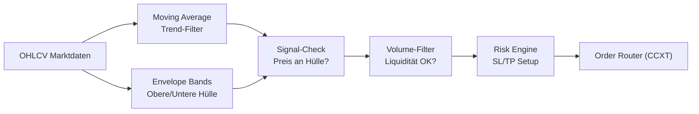

# 📊 LTBBot - Envelope Trading Strategy Bot

<div align="center">


[](https://www.python.org/)
[](https://github.com/ccxt/ccxt)
[](LICENSE)

**Ein hochoptimierter Trading-Bot basierend auf der Envelope-Strategie mit Mean-Reversion und automatischer Parameteroptimierung**

[Features](#-features) • [Installation](#-installation) • [Konfiguration](#-konfiguration) • [Live-Trading](#-live-trading) • [Pipeline](#-interaktives-pipeline-script) • [Monitoring](#-monitoring--status) • [Wartung](#-wartung)

</div>

---

## 📊 Übersicht

LTBBot ist ein spezialisierter Trading-Bot, der die Envelope-Strategie (Moving Average Envelopes) verwendet, um profitable Trading-Gelegenheiten durch Mean-Reversion zu identifizieren. Das System nutzt automatische Parameter-Optimierung und kann mehrere Handelspaare gleichzeitig verwalten.

### 🧭 Trading-Logik (Kurzfassung)
- **Mean-Reversion via Envelopes**: Geht Long bei Rücklauf an die untere Hülle (Reversion zum Mittelwert), reduziert/flacht an der oberen Hülle
- **Mittellinie als Bias-Filter**: Moving Average dient als Trend-Filter (Long nur wenn MA steigt)
- **Volumen-Check**: Trades nur bei Mindestvolumen-Ratio zur Vermeidung illiquider Moves
- **Risk Layer**: Fester Stop-Loss/Take-Profit + optionaler Trailing-Stop; Positionsgröße abhängig von Risiko je Trade
- **Optimizer-Loop**: Automatische Suche nach optimalen Envelope-Bandbreiten, MA-Längen und SL/TP-Kombinationen
- **Execution**: CCXT für Order-Platzierung mit realistischer Slippage-Simulation

### 🔍 Strategie-Visualisierung

```mermaid
flowchart LR
    A["OHLCV Marktdaten"]
    B["Moving Average<br/>Trend-Filter"]
    C["Envelope Bands<br/>Obere/Untere Hülle"]
    D["Signal-Check<br/>Preis an Hülle?"]
    E["Volume-Filter<br/>Liquidität OK?"]
    F["Risk Engine<br/>SL/TP Setup"]
    G["Order Router (CCXT)"]

    A --> B
    A --> C
    B & C --> D --> E --> F --> G
```

### 📈 Trade-Beispiel (Entry/SL/TP)
- **Setup**: Preis dippt an die untere Envelope; Volumen ok; MA-Slope leicht steigend (Uptrend-Filter)
- **Entry**: Long an der unteren Hülle mit Telegram-Alert
- **Initial SL**: Unter letztem Swing-Low oder unter der unteren Hülle - x% Puffer
- **TP**: Rückkehr zur Mittellinie oder obere Hülle (konservativ/aggressiv wählbar)
- **Trailing**: Nach Erreichen der Mittellinie Trail unter das letzte Higher Low nachziehen; lässt Ausdehnung bis zur oberen Hülle zu

---

## 🚀 Features

### Trading Features
- ✅ Envelope-basierte Ein- und Ausstiegssignale
- ✅ Unterstützt mehrere Kryptowährungspaare (BTC, ETH, SOL, DOGE, etc.)
- ✅ Flexible Timeframe-Unterstützung (15m, 30m, 1h, 4h, 1d)
- ✅ Automatische Positionsgröße basierend auf verfügbarem Kapital
- ✅ Volumen-basierte Filter für höhere Signal-Qualität
- ✅ Fester Stop-Loss und Take-Profit Management
- ✅ Telegram-Benachrichtigungen bei neuen Signalen und Trades

### Technical Features
- ✅ CCXT Integration für mehrere Börsen
- ✅ Moving Average Envelope Indikatoren
- ✅ Optuna Hyperparameter-Optimierung
- ✅ Backtesting mit realistischer Slippage-Simulation (Live-Bot-Aligned)
- ✅ Robust Error-Handling und Logging
- ✅ Walk-Forward-Analyse für robuste Parameter
- ✅ Portfolio-Optimierung (Greedy Calmar-Ratio + Einzelstrategie-Verifikation)
- ✅ Regime-Filter (ADX-basiert: TREND, STRONG_TREND, NEUTRAL)
- ✅ Konditionelles Config-Speichern (nur besser → überschreiben)

---

## 📋 Systemanforderungen

### Hardware
- **CPU**: Multi-Core Prozessor (Intel i5 oder besser empfohlen)
- **RAM**: Minimum 2GB, empfohlen 4GB+
- **Speicher**: 1GB freier Speicherplatz

### Software
- **OS**: Linux (Ubuntu 20.04+), macOS, Windows 10/11
- **Python**: Version 3.8 oder höher
- **Git**: Für Repository-Verwaltung

---

## 💻 Installation

### 1. Repository klonen

```bash
git clone https://github.com/Youra82/ltbbot.git
cd ltbbot
```

### 2. Automatische Installation (empfohlen)

```bash
# Linux/macOS
chmod +x install.sh
./install.sh

# Windows (PowerShell)
python -m venv .venv
.venv\Scripts\activate
pip install -r requirements.txt
```

Das Installations-Script führt folgende Schritte aus:
- ✅ Erstellt eine virtuelle Python-Umgebung (`.venv`)
- ✅ Installiert alle erforderlichen Abhängigkeiten
- ✅ Erstellt notwendige Verzeichnisse (`data/`, `logs/`, `artifacts/`)
- ✅ Initialisiert Konfigurationsdateien

### 3. API-Credentials konfigurieren

Erstelle eine `secret.json` Datei im Root-Verzeichnis:

```json
{
  "ltbbot": [
    {
      "name": "Binance Trading Account",
      "exchange": "binance",
      "apiKey": "DEIN_API_KEY",
      "secret": "DEIN_SECRET_KEY",
      "options": {
        "defaultType": "future"
      }
    }
  ]
}
```

⚠️ **Wichtig**: 
- Niemals `secret.json` committen oder teilen!
- Verwende nur API-Keys mit eingeschränkten Rechten (Nur Trading, keine Withdrawals)
- Aktiviere IP-Whitelist auf der Exchange

### 4. Trading-Strategien konfigurieren

Bearbeite `settings.json` für deine gewünschten Handelspaare:

```json
{
  "live_trading_settings": {
    "active_strategies": [
      {
        "symbol": "BTC/USDT:USDT",
        "timeframe": "4h",
        "use_envelope_bands": true,
        "active": true
      },
      {
        "symbol": "ETH/USDT:USDT",
        "timeframe": "1h",
        "use_envelope_bands": true,
        "active": true
      }
    ]
  }
}
```

**Parameter-Erklärung**:
- `symbol`: Handelspaar (Format: BASE/QUOTE:SETTLE)
- `timeframe`: Zeitrahmen (15m, 30m, 1h, 4h, 1d)
- `use_envelope_bands`: Envelope-Filter aktivieren (true/false)
- `active`: Strategie aktiv (true/false)

---

## 🔴 Live Trading

### Start des Live-Trading

```bash
# Master Runner starten (verwaltet alle aktiven Strategien)
cd /home/ubuntu/ltbbot && .venv/bin/python3 master_runner.py
```

### Manuell starten / Cronjob testen
Ausführung sofort anstoßen (ohne auf den 15-Minuten-Cron zu warten):

```bash
cd /home/ubuntu/ltbbot && .venv/bin/python3 master_runner.py
```

Der Master Runner:
- ✅ Lädt Konfigurationen aus `settings.json`
- ✅ Startet separate Prozesse für jede aktive Strategie
- ✅ Generiert Envelope-basierte Signale
- ✅ Überwacht Kontostand und verfügbares Kapital
- ✅ Managed Positionen und Risk-Limits
- ✅ Loggt alle Trading-Aktivitäten
- ✅ Sendet Telegram-Benachrichtigungen

### Automatischer Start (Produktions-Setup)

Richte den automatischen Prozess für den Live-Handel ein.

```bash
crontab -e
```

Füge die folgende **eine Zeile** am Ende der Datei ein. Passe den Pfad an, falls dein Bot nicht unter `/home/ubuntu/ltbbot` liegt.

```
# Starte den LTBBot Master-Runner alle 15 Minuten
*/15 * * * * /usr/bin/flock -n /home/ubuntu/ltbbot/ltbbot.lock /bin/sh -c "cd /home/ubuntu/ltbbot && .venv/bin/python3 master_runner.py >> /home/ubuntu/ltbbot/logs/cron.log 2>&1"
```

*(Hinweis: `flock` ist eine gute Ergänzung, um Überlappungen zu verhindern, aber für den Start nicht zwingend notwendig.)*

Logverzeichnis anlegen:

```bash
mkdir -p /home/ubuntu/ltbbot/logs
```


---

## 📊 Interaktives Pipeline-Script

Das **`run_pipeline.sh`** Script automatisiert die Parameter-Optimierung für deine Handelsstrategien. Es führt einen Grid-Search über alle Envelope- und MA-Parameter durch und findet die optimalen Einstellungen für dein ausgewähltes Symbol und Timeframe.

### Features des Pipeline-Scripts

✅ **Interaktive Eingabe** - Einfache Menü-Navigation  
✅ **Automatische Datumswahl** - Zeitrahmen-basierte Lookback-Berechnung  
✅ **Optuna-Optimierung** - Bayessche Hyperparameter-Suche  
✅ **Ladebalken** - Visueller Fortschritt  
✅ **Batch-Optimierung** - Mehrere Symbol/Timeframe-Kombinationen  
✅ **Automatisches Speichern** - Optimale Konfigurationen als JSON  
✅ **Integrierte Backtests** - Sofort nach Optimierung testen  

### Verwendung

```bash
# Pipeline starten
chmod +x run_pipeline.sh
./run_pipeline.sh
```

### Interaktive Eingaben

Das Script fragt dich nach folgende Informationen:

#### 1. Symbol eingeben
```
Welche(s) Symbol(e) möchtest du optimieren?
(z.B. BTC oder: BTC ETH SOL)
> BTC
```

#### 2. Timeframe eingeben
```
Welche(s) Timeframe(s)?
(z.B. 1d oder: 1d 4h 1h)
> 1d
```

#### 3. Startdatum eingeben
```
Startdatum (YYYY-MM-DD oder 'a' für automatisch)?
Automatische Optionen pro Timeframe:
  5m/15m    → 60 Tage Lookback
  30m/1h    → 180 Tage Lookback
  4h/2h     → 365 Tage Lookback
  6h/1d     → 730 Tage Lookback
> a
```

#### 4. Startkapital eingeben
```
Mit wieviel USD starten? (Standard: 100)
> 100
```

### Optimierte Konfigurationen

Nach erfolgreicher Optimierung werden die besten Parameter gespeichert unter:

```
src/ltbbot/strategy/configs/
├── config_BTCUSDTUSDT_1d_envelope.json
├── config_BTCUSDTUSDT_4h_envelope.json
├── config_ETHUSDTUSDT_1h_envelope.json
└── config_AAVEUSDTUSDT_2h_envelope.json
```

**Beispiel-Konfiguration** (`config_BTCUSDTUSDT_4h_envelope.json`):

```json
{
  "market": {
    "symbol": "BTC/USDT:USDT",
    "timeframe": "4h"
  },
  "strategy": {
    "ma_period": 20,
    "envelope_pct": 2.5,
    "sl_pct": 2.0,
    "tp_pct": 4.0
  },
  "_meta": {
    "pnl_pct": 124.5,
    "max_drawdown_pct": 18.3,
    "win_rate": 62.0,
    "num_trades": 45
  }
}
```

### Integration mit Live-Trading

Die optimierten Konfigurationen werden **automatisch geladen**:

```bash
./show_results.sh
```

**`show_results.sh` bietet 4 Analyse-Modi:**

| Option | Beschreibung |
|--------|-------------|
| 1 | Einzelne Strategie backtesten (Backtester) |
| 2 | Portfolio-Simulation mehrerer Strategien |
| 3 | Portfolio-Optimierung (Greedy Calmar-Ratio) |
| 4 | Walk-Forward-Analyse |

Alle Modi nutzen denselben einheitlichen Backtesting-Engine:
- ✅ Max. 1 offene Position pro Strategie (Live-Bot-Alignment)
- ✅ Statisches Startkapital (kein Compounding) für realistische Risikobewertung
- ✅ SL 1.5× breiter im TREND-Regime (ADX 25–30)
- ✅ Trend-Bias: UPTREND = nur Longs, DOWNTREND = nur Shorts

---

## 📊 Monitoring & Status

### Status-Dashboard

```bash
# Zeigt alle wichtigen Informationen
./show_status.sh
```

**Angezeigt**:
- 📊 Aktuelle Konfiguration
- 🔐 API-Status
- 📈 Offene Positionen
- 💰 Kontostand
- 📝 Letzte Logs

### Log-Files

```bash
# Live-Trading Logs
tail -f logs/cron.log

# Fehler-Logs
tail -f logs/error.log

# Strategie-Logs
tail -n 100 logs/ltbbot_BTCUSDTUSDT_4h.log
```

### Performance-Metriken

```bash
# Trade-Analyse
python analyze_real_trades_detailed.py

# Vergleich Backtest vs. Live
python compare_real_vs_backtest.py
```

---

## 🛠️ Wartung & Pflege

### Tägliche Verwaltung

#### Logs ansehen

```bash
# Logs live mitverfolgen
tail -f logs/cron.log

# Letzten 500 Zeilen anzeigen
tail -n 500 logs/*.log

# Nach Fehlern durchsuchen
grep -i "ERROR" logs/cron.log
```

#### Cronjob manuell testen

```bash
cd /home/ubuntu/ltbbot && .venv/bin/python3 master_runner.py
```

### 🔧 Config-Management

#### Konfigurationsdateien löschen

Bei Bedarf können alle generierten Konfigurationen gelöscht werden:

```bash
rm -f src/ltbbot/strategy/configs/config_*.json
```

#### Löschung verifizieren

```bash
ls -la src/ltbbot/strategy/configs/config_*.json 2>&1 || echo "✅ Alle Konfigurationsdateien wurden gelöscht"
```

### Bot aktualisieren

```bash
chmod +x update.sh
bash ./update.sh
```


### Tests ausführen

```bash
# Alle Tests
./run_tests.sh

# Spezifische Tests
pytest tests/test_strategy.py
pytest tests/test_envelope.py -v

# Mit Coverage
pytest --cov=src tests/
```

---

## 🔄 Auto-Optimizer Verwaltung

Der Bot verfügt über einen automatischen Optimizer, der wöchentlich die besten Parameter für alle aktiven Strategien sucht (Envelope-Strategie). Die folgenden Befehle helfen beim manuellen Triggern, Debugging und Monitoring des Optimizers.

### Optimizer manuell triggern

Um eine sofortige Optimierung zu starten (ignoriert das Zeitintervall):

```bash
# Letzten Optimierungszeitpunkt löschen (erzwingt Neustart)
rm ~/ltbbot/data/cache/.last_optimization_run

# Master Runner starten (prüft ob Optimierung fällig ist)
cd ~/ltbbot && .venv/bin/python3 master_runner.py
```

Oder direkt per `--force`:

```bash
cd ~/ltbbot && .venv/bin/python3 auto_optimizer_scheduler.py --force
```

### Optimizer-Logs überwachen

```bash
# Optimizer-Log live mitverfolgen
tail -f ~/ltbbot/logs/auto_optimizer_trigger.log

# Letzte 50 Zeilen des Optimizer-Logs anzeigen
tail -50 ~/ltbbot/logs/auto_optimizer_trigger.log
```

### Optimierungsergebnisse ansehen

```bash
# Beste gefundene Parameter anzeigen (erste 50 Zeilen)
cat ~/ltbbot/artifacts/results/last_optimizer_run.json | head -50
```

### Optimizer-Prozess überwachen

```bash
# Prüfen ob Optimizer gerade läuft (aktualisiert jede Sekunde)
watch -n 1 "ps aux | grep optimizer"
```

### Optimizer stoppen

```bash
# Alle Optimizer-Prozesse auf einmal stoppen
pkill -f "auto_optimizer_scheduler" ; pkill -f "run_pipeline_automated" ; pkill -f "optimizer.py"

# Prüfen ob alles gestoppt ist
pgrep -fa "optimizer" && echo "Noch aktiv!" || echo "Alle gestoppt."

# In-Progress-Marker aufräumen (sauberer Neustart danach)
rm -f ~/ltbbot/data/cache/.optimization_in_progress
```

---

## 🆕 Aktuelle Verbesserungen

### Backtester & Live-Bot Alignment
- **Max. 1 Position pro Strategie** — identisch mit Live-Bot-Verhalten
- **Statisches Startkapital** für Positionsgrößen-Berechnung (kein Compounding)
- **Regime-Filter**: STRONG_TREND (ADX > 30) → keine neuen Entries; TREND (ADX 25–30) → SL 1.5× breiter
- **Trend-Bias**: UPTREND (EMA up) = nur Longs; DOWNTREND = nur Shorts

### Portfolio-Optimizer: Einzelstrategie-Prüfung
Der greedy Portfolio-Optimizer prüft jetzt nach der Portfolio-Zusammenstellung, ob eine einzelne Strategie das Portfolio in Bezug auf **rohen PnL%** schlägt:
- Verwendet `run_envelope_backtest()` (kein Compounding, echte Drawdown-Messung) für den Vergleich
- Falls eine Einzelstrategie besser ist und das DD-Constraint erfüllt → wird diese gewählt

### Exchange-Log-Vereinfachung
Daten-Downloads loggen jetzt nur noch eine einzige Zusammenfassungszeile:
```
Daten geladen: BTC/USDT:USDT (4h) | 2024-01-01 → 2025-01-01 | 2200 Kerzen
```

### Konditionelles Config-Speichern
Der Optimizer überschreibt bestehende Konfigurationen nur, wenn der neue `pnl_pct` die gespeicherte Performance übertrifft.

---

## 📂 Projekt-Struktur

```
ltbbot/
├── src/
│   └── ltbbot/
│       ├── strategy/              # Trading-Logik
│       │   ├── run.py
│       │   ├── envelope_detector.py
│       │   └── configs/           # Optimierte Konfigurationen (JSON)
│       ├── analysis/              # Analyse & Optimierung
│       │   ├── backtester.py      # Einzel-Strategie Backtest
│       │   ├── optimizer.py       # Optuna Parameter-Suche
│       │   ├── portfolio_optimizer.py  # Greedy Portfolio-Optimierung
│       │   ├── portfolio_simulator.py  # Multi-Strategie Simulation
│       │   ├── show_results.py    # Interaktive Ergebnisanzeige
│       │   └── interactive_status.py  # Live-Status Dashboard
│       └── utils/                 # Hilfsfunktionen
│           ├── exchange.py
│           └── telegram.py
├── tests/                         # Unit-Tests
├── data/                          # Marktdaten & Cache
├── logs/                          # Log-Files
├── artifacts/                     # Ergebnisse & DB
├── master_runner.py               # Haupt-Entry-Point
├── run_pipeline.sh                # Optimierungs-Pipeline (interaktiv)
├── show_results.sh                # Backtest & Portfolio-Analyse
├── settings.json                  # Konfiguration
├── secret.json                    # API-Credentials (nicht committen!)
└── requirements.txt               # Dependencies
```

---

## ⚠️ Wichtige Hinweise

### Risiko-Disclaimer

⚠️ **Trading mit Kryptowährungen birgt erhebliche Risiken!**

- Nur Kapital einsetzen, dessen Verlust Sie verkraften können
- Keine Garantie für Gewinne
- Vergangene Performance ist kein Indikator für zukünftige Ergebnisse
- Testen Sie ausgiebig mit Demo-Accounts
- Starten Sie mit kleinen Beträgen

### Security Best Practices

- 🔐 Niemals API-Keys mit Withdrawal-Rechten verwenden
- 🔐 IP-Whitelist auf Exchange aktivieren
- 🔐 2FA für Exchange-Account aktivieren
- 🔐 `secret.json` niemals committen (in `.gitignore`)
- 🔐 Regelmäßige Security-Updates durchführen

### Performance-Tipps

- 💡 Starten Sie mit 1-2 Strategien
- 💡 Verwenden Sie längere Timeframes (4h+)
- 💡 Monitoren Sie regelmäßig die Performance
- 💡 Parameter regelmäßig überprüfen
- 💡 Position-Sizing angemessen konfigurieren

---

## 🤝 Support & Community

### Probleme melden

Bei Problemen:

1. Prüfen Sie die Logs
2. Führen Sie Tests aus: `./run_tests.sh`
3. Öffnen Sie ein Issue mit Log-Auszügen

### Updates erhalten

```bash
git fetch origin
git status
./update.sh
```

### Optimierte Konfigurationen hochladen

```bash
git add src/ltbbot/strategy/configs/config_*_envelope.json
git commit -m "Update: Aktuelle Envelope-Konfigurationen"
git push origin main
```

---

## Coin & Timeframe Empfehlungen

LTBBot ist eine **Mean-Reversion-Strategie** — er wartet, dass der Preis von einer Envelope-Band zur gleitenden Mitte zurückfindet. Das Gegenteil von Trendfolge: gefragt sind Coins, die schwingen statt dauerhaft zu trenden. STRONG_TREND (ADX > 30) blockiert alle Einträge komplett.

### Effektive Zeitspannen je Timeframe

| TF | MA(8) — Mittelachse | ADX(14) — Regime | ATR(10) — SuperTrend | Geeignet |
|---|---|---|---|---|
| 15m | 2h | 3.5h | 2.5h | ❌ |
| 30m | 4h | 7h | 5h | ⚠️ |
| 1h | 8h | 14h | 10h | ✅ |
| 2h | 16h | 28h | 20h | ✅ |
| **4h** | **32h** | **56h** | **40h** | **✅✅** |
| **6h** | **48h** | **84h** | **60h** | **✅✅** |
| 1d | 8d | 14d | 10d | ✅ |

Auf 15m/30m ist die ADX-Regime-Erkennung nur wenige Stunden alt — zu schnelle Wechsel. Ab 4h umspannt ADX fast 2.5 Tage und trennt echtes Ranging von echtem Trend zuverlässig.

### Coin-Eignung

| Coin | Mean-Reversion | Envelope-Verhalten | Bewertung |
|---|---|---|---|
| **AAVE** | Stark — oscilliert regelmäßig um MA | Trifft alle 3 Bänder bei Vola-Phasen | ✅✅ Beste Wahl |
| **ETH** | Gut — ausreichend Rückkehr zur Mitte | Klare Envelope-Touchdowns | ✅✅ Sehr gut |
| **BNB** | Gut — stabile niedrige Volatilität | Enge Bänder funktionieren gut | ✅ Gut |
| **XRP** | Gut — lange Seitwärtsphasen mit Schwingung | Moderate Bänder, häufige Berührungen | ✅ Gut |
| **ADA** | Gut — rangelastig, oscilliert | Passt gut zu Envelope-Logik | ✅ Gut |
| **LTC** | Gut — BTC-korreliert, moderates Verhalten | Gut auf 4h/6h | ✅ Gut |
| **AVAX** | Mittel — trendet oft, aber mit Rücksetzern | Funktioniert in Konsolidierungsphasen | ⚠️ Mittel |
| **SOL** | Mittel — trendet zu stark für Reversion | Bänder werden übersprungen | ⚠️ Mittel |
| **BTC** | Mittel — klare Trends, Reversion auf 1d | 1d-Timeframe empfohlen | ⚠️ Mittel |
| **DOT** | Mittel — sehr lange Seitwärtsphasen | Wenige klare Signale | ⚠️ Mittel |
| **LINK** | Schwach in Bull — trendet explosiv | Bänder werden überrannt | ⚠️ Schwach |
| **DOGE** | Schlecht — sentiment-getrieben | Zufällige Band-Berührungen | ❌ Schlecht |
| **SHIB/PEPE** | Nicht vorhanden — reine Pumps | Keine strukturierten Bänder | ❌❌ Nicht geeignet |

### Empfohlene Kombinationen (Ranking)

| Rang | Kombination | Begründung |
|---|---|---|
| 🥇 1 | **AAVE 4h / 6h** | Stärkste Mean-Reversion, alle 3 Bänder regelmäßig berührt |
| 🥇 1 | **ETH 4h / 6h** | Klare Rückkehr zur Mitte, Regime gut klassifizierbar |
| 🥈 2 | **BNB 4h** | Stabil, niedrige Volatilität, häufiges RANGE-Regime |
| 🥈 2 | **XRP 4h / 6h** | Lange Seitwärtsphasen — ideal für Mean-Reversion |
| 🥉 3 | **ADA 4h** | Gut in Bear/Seitwärts, schwächer in Bull |
| 4 | **LTC 4h** | BTC-korreliert, moderate Reversion-Bewegungen |
| 4 | **BTC 1d** | Auf Tagesbasis gute Reversion-Phasen vorhanden |
| 4 | **SOL 2h** | Kürzeres TF um Trend-Blocks zu reduzieren |
| ❌ | **Alles auf 15m** | ADX-Regime zu kurzfristig, zu viele Fehlsignale |
| ❌ | **DOGE / SHIB** | Kein strukturiertes Mean-Reversion-Verhalten |

> **Hinweis:** In starken Bullmärkten blockiert STRONG_TREND viele Einträge — das ist gewollt. LTBBot performt am besten in Seitwärts- und moderaten Trendmärkten.


---

## 📜 Lizenz

Dieses Projekt ist lizenziert unter der MIT License.

---

## 🙏 Credits

Entwickelt mit:
- [CCXT](https://github.com/ccxt/ccxt)
- [Optuna](https://optuna.org/)
- [Pandas](https://pandas.pydata.org/)
- [TA-Lib](https://github.com/mrjbq7/ta-lib)

---

<div align="center">

**Made with ❤️ by the LTBBot Team**

⭐ Star uns auf GitHub wenn dir dieses Projekt gefällt!

[🔝 Nach oben](#-ltbbot---envelope-trading-strategy-bot)

</div>
