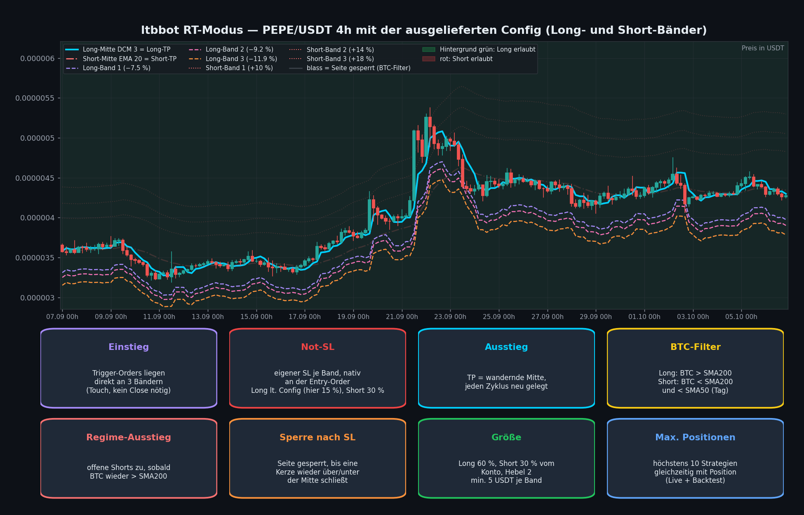
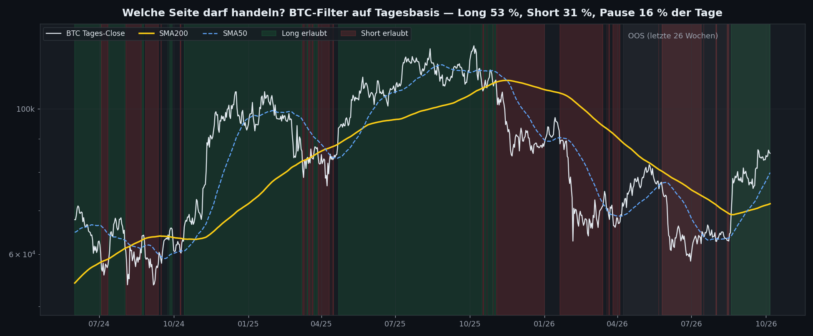
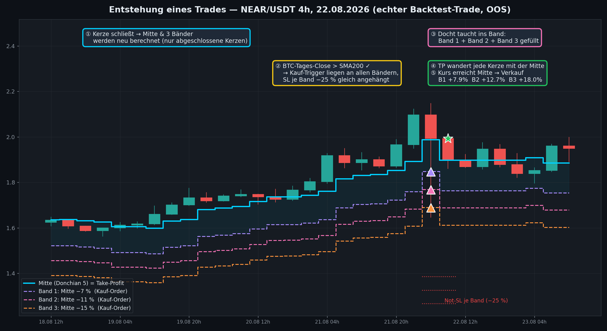
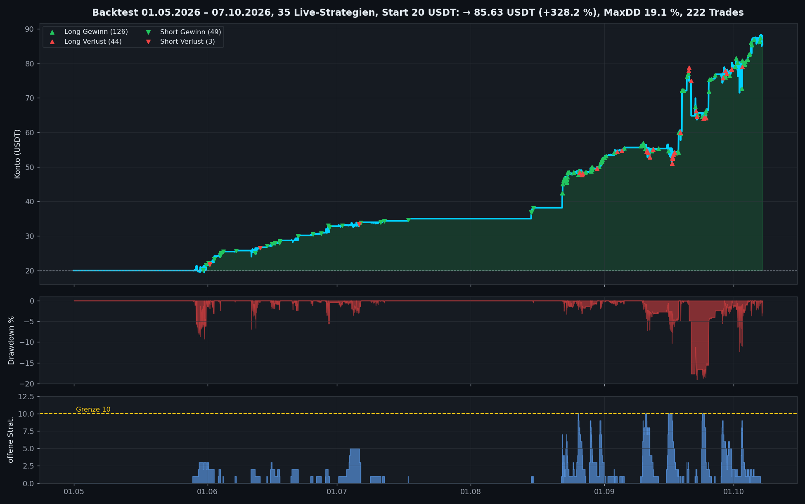
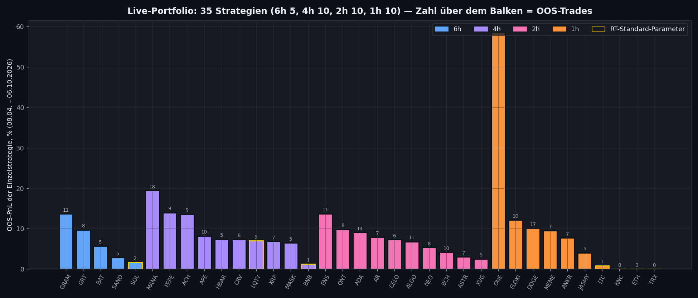
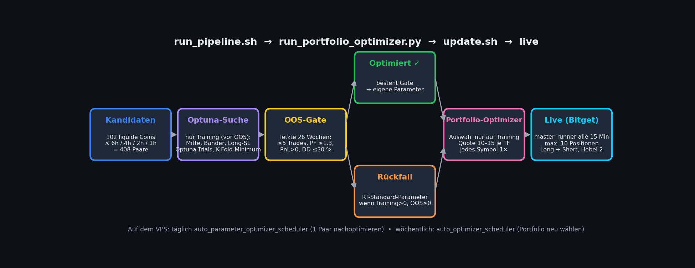
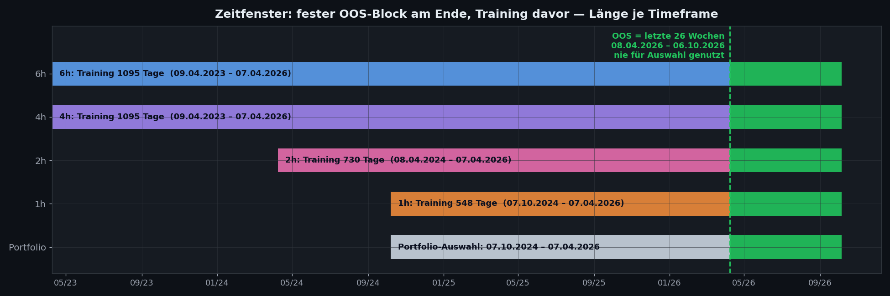

# 📊 LTBBot – Envelope-Trading-Bot (RobotTraders-Modus, Long + Short)

<div align="center">


[](https://www.python.org/)
[](https://github.com/ccxt/ccxt)
[](https://www.bitget.com/)

**Mean-Reversion an Moving-Average-Envelopes auf Bitget-Perpetuals – Long im BTC-Aufwärtstrend, Short im BTC-Abwärtstrend,
35 Strategien auf 6h / 4h / 2h / 1h, höchstens 10 gleichzeitig offen.**

[Strategie](#-die-strategie) • [Ergebnisse](#-ergebnisse) • [Pipeline](#-pipeline-und-zeitfenster) • [Installation](#-installation) • [Live-Trading](#-live-trading) • [Werkzeuge](#-werkzeuge) • [Wartung](#-wartung)

</div>

---

## 📌 Stand (2026-10-07)

| Baustein | Einstellung |
|---|---|
| Modus | `strategy_mode: "rt"` – RobotTraders-Original-Envelope, ehrlich nachgetestet |
| Seiten | **Long** wenn BTC-Tages-Close > SMA200, **Short** wenn BTC < SMA200 **und** < SMA50 |
| Portfolio | **35 Strategien**: 6h 5 · 4h 10 · 2h 10 · 1h 10 (jedes Symbol nur einmal) |
| Gleichzeitig offen | **max. 10 Strategien** mit Position (Live und Backtest identisch) |
| Größe | Long **60 %**, Short **30 %** des Kontos je Position, **Hebel 2**, min. 5 USDT je Band |
| Prüfzeitraum | **OOS = fest die letzten 26 Wochen**; trainiert und ausgewählt wird nur davor |
| Backtest 01.05.–07.10.2026 | 20 → **85.63 USDT (+328 %)**, MaxDD **19.1 %**, 222 Trades, Trefferquote 79 %, Ø **+3.13 %/Trade** |

> ⚠️ Im Training (10/2024–04/2026, inkl. Crash vom 10.10.2025) hatte dasselbe Portfolio einen **MaxDD von 55.9 %**.
> Die gute OOS-Phase ist kein Versprechen – siehe [Risiken](#️-risiken).

---

## 🤖 Die Strategie



Der Bot legt um eine gleitende **Mitte** drei Bänder darunter (Long) und drei darüber (Short). Fällt der Kurs ins
untere Band, wird gekauft; der Gewinn wird an der **Mitte** mitgenommen. Short funktioniert spiegelbildlich, aber mit
eigenen, festen Parametern (die gespiegelten Long-Werte verloren im Test).

| Baustein | Long | Short | Config-Schalter |
|---|---|---|---|
| Mitte | vom Optimizer gesucht (SMA / EMA / Donchian …) | **EMA 20** | `average_type`, `average_period`, `strategy.short.*` |
| Bänder | 3 Bänder, vom Optimizer gesucht (RT-Standard −7 / −11 / −15 %) | **+10 / +14 / +18 %** | `envelopes`, `strategy.short.envelopes` |
| Einstieg | Trigger-Order **direkt am Band** (Docht genügt, kein Close nötig) | gleich | `strategy.entry_mode: "touch"` |
| Not-SL | je Band, vom Optimizer gesucht, nativ an der Entry-Order | **30 %** | `risk.stop_loss_pct`, `risk.short_stop_loss_pct` |
| Take-Profit | wandernde Mitte, jeden 15-Min-Zyklus neu gelegt | Short-Mitte | – |
| BTC-Filter | BTC-Tages-Close > SMA200 | BTC < SMA200 **und** < SMA50 | `strategy.btc_trend_filter`, `strategy.short.btc_filter: "sma200_sma50"` |
| Regime-Ausstieg | – | offene Shorts zu, sobald BTC wieder > SMA200 | `strategy.short.regime_exit: true` |
| Nach SL | Seite gesperrt, bis eine Kerze wieder **über** der Mitte schließt | spiegelbildlich | `strategy.reentry_after_sl: "cross_average"` |
| Größe | 60 % des Kontos, auf die Bänder verteilt | 30 % | `risk.position_size_pct`, `risk.short_position_size_pct` |
| Hebel | 2 | 2 | `risk.leverage` |
| Mindestorder | unter 5 USDT Notional wird auf die Bitget-Mindestorder angehoben und auf die Kontraktgröße aufgerundet | gleich | `risk.min_notional_bump`, `market.amount_step` |
| Positions-Grenze | höchstens 10 Strategien gleichzeitig mit Position, sonst keine neuen Einstiege | gleich | `live_trading_settings.max_concurrent_positions` |
| ADX / Trend-Sperren | keine | keine | `strategy.regime_filter: false` |

Live, Backtest und Portfolio-Simulator nutzen **dieselben Funktionen** aus
[`envelope_logic.py`](src/ltbbot/strategy/envelope_logic.py) (BTC-Filter, Sperre nach SL, Größe, Positions-Grenze,
Regime-Ausstieg). Tests: [`tests/test_rt_mode.py`](tests/test_rt_mode.py).

### 🧭 Welche Seite darf handeln?



Grün = nur Long, rot = nur Short, dunkel = Pause (BTC unter SMA200, aber über SMA50 – typische Erholungsrallye, in der
Shorts früher verloren). Gemessen wird an der **letzten abgeschlossenen** BTC-Tageskerze, live wie im Backtest.

### 🧩 So entsteht ein Trade



*Echter Backtest-Trade im OOS mit der ausgelieferten Config:*

1. **Kerze schließt** → Mitte und Bänder werden aus den *abgeschlossenen* Kerzen neu berechnet – kein Blick in die laufende Kerze.
2. **Filter prüfen**: BTC-Regime erlaubt die Seite, weniger als 10 Strategien haben eine Position, keine Sperre nach SL.
   Dann liegen Trigger-Orders an allen drei Bändern; jede trägt ihren eigenen Not-SL (Bitget legt ihn beim Fill an).
3. **Docht taucht ins Band** → Band 1, 2, 3 werden nacheinander gefüllt (tiefer = günstiger).
4. **TP wandert**: jeden 15-Min-Zyklus wird ein gebündelter TP an die aktuelle Mitte gelegt.
5. **Ausstieg an der Mitte** → alle Bänder schließen gemeinsam. Die Prozentzahlen im Bild sind Kursbewegung; aufs
   eingesetzte Kapital wirkt Hebel 2.

Geht der Kurs stattdessen bis zum Not-SL, sperrt der Bot diese Seite auf dem Coin, bis eine Kerze wieder über (Long)
bzw. unter (Short) der Mitte schließt (RobotTraders-`ReentryGuard`).

---

## 📈 Ergebnisse

### Backtest 01.05.2026 – 07.10.2026 (20 USDT Gesamtkapital)



| Kennzahl | Wert |
|---|---|
| Start → Ende | 20.00 → **85.63 USDT (+328.2 %)** |
| Max. Drawdown | **19.1 %** |
| Trades | 222 (Long 170, Short 52) |
| Trefferquote | 79 % |
| Ø je Trade | **+3.13 %** |
| Stop-Loss-Ausstiege | 7 |
| Gleichzeitig offen | max. 10 (Grenze wird erreicht, siehe unteres Feld) |

Das Portfolio wurde **nur mit Daten bis 07.04.2026** ausgewählt; alles ab 08.04.2026 ist echtes Out-of-Sample.
Bis Ende Mai gab es keinen Trade (BTC in der Pause-Zone), danach zuerst Shorts, ab August fast nur Longs.

### Die 35 Strategien im Live-Portfolio



Jede Strategie hat das OOS-Gate einzeln bestanden oder läuft mit den RT-Standard-Parametern (gelb umrandet: Training
positiv, OOS nicht negativ). ETH, KNC und TRX (1h) hatten im OOS-Fenster kein einziges Signal und wurden allein wegen
ihres Trainings-Beitrags gewählt.

### Entscheidungen auf dem Weg hierher

| Datum | Änderung | Grund |
|---|---|---|
| 2026-10-04 | Rückkehr zum Envelope-Stand `9a404ef` | Breakout-Variante verworfen |
| 2026-10-05 | RT-Modus (Orders am Band, Not-SL, BTC-Filter, Sperre nach SL) | 846 Binance-Perps inkl. delisteter: nur Long + BTC-Filter **+0.86 %/Trade, t = 6.5** im OOS |
| 2026-10-05 | Short-Seite mit Schutzhebeln A (Regime-Ausstieg), B (SMA200 + SMA50), C (kleinere Shorts) | ohne BTC-Filter ruinierte Long + Short das Konto (−80 %) |
| 2026-10-06 | 60 % / Hebel 2 | größte Einstellung, bei der ein voller SL über 3 Bänder ~30 % des Kontos kostet |
| 2026-10-06 | OOS fest 26 Wochen, Training davor je Timeframe | nur die aktuelle Marktphase soll entscheiden |
| 2026-10-06 | 4 Timeframes mit Quote 10–15, max. 10 Positionen | mehr Signale, begrenzte Gleichzeitigkeit |
| 2026-10-07 | Telegram „Kapital voll im Einsatz“ nur noch bei Zustandswechsel | vorher eine Meldung je Strategie und Zyklus |

---

## 🔁 Pipeline und Zeitfenster





| Schritt | Was passiert | Einstellung |
|---|---|---|
| Kandidaten | 102 liquideste Bitget-Coins × 6h / 4h / 2h / 1h | `optimization_settings.candidate_strategies` |
| Zeitfenster | OOS = letzte 26 Wochen bis gestern; Training davor: 6h/4h 1095, 2h 730, 1h 548 Tage | `oos_weeks`, `train_days_by_timeframe` ([`oos_window.py`](src/ltbbot/utils/oos_window.py)) |
| Optuna-Suche | Mitte, Bänder und Long-SL **nur auf dem Training**, K-Fold-Minimum gegen Zufallstreffer | `run_pipeline.sh` → `optimizer.py` |
| OOS-Gate | ≥ 5 OOS-Trades, Profit-Faktor ≥ 1.3, PnL > 0, DD ≤ 30 % → eigene Parameter | `min_oos_trades`, `min_oos_profit_factor` |
| Rückfall | sonst RT-Standard-Parameter, wenn Training > 0 und OOS ≥ 0 | – |
| Portfolio-Optimizer | wählt **nur auf dem Training**, Quote 10–15 je Timeframe, jedes Symbol einmal; Bericht läuft bis heute mit markiertem OOS-Teil | `portfolio_quota`, `run_portfolio_optimizer.py` |
| Live | `master_runner.py` alle 15 Min, je Strategie ein Prozess | `live_trading_settings` |

Junge Coins ohne Historie bis zum Trainingsbeginn (z. B. auf 4h/6h vor 2023) werden übersprungen.

---

## 💻 Installation

```bash
git clone https://github.com/Youra82/ltbbot.git
cd ltbbot
chmod +x install.sh && ./install.sh      # legt .venv an und installiert requirements.txt
```

Windows (nur Entwicklung/Backtests):

```powershell
python -m venv .venv
.venv\Scripts\activate
pip install -r requirements.txt
```

### API-Zugang (`secret.json` im Hauptordner)

```json
{
  "ltbbot": [
    {
      "name": "DeinAccountName",
      "apiKey": "DEIN_API_KEY",
      "secret": "DEIN_SECRET",
      "password": "DEINE_API_PASSPHRASE"
    }
  ],
  "telegram": {
    "bot_token": "DEIN_BOT_TOKEN",
    "chat_id": "DEINE_CHAT_ID"
  }
}
```

⚠️ `secret.json` nie committen oder teilen. API-Key nur mit Trading-Rechten (keine Auszahlungen), IP-Whitelist aktivieren.

---

## 🔴 Live-Trading

### Cronjob (VPS)

```bash
crontab -e
```

```
*/15 * * * * /usr/bin/flock -n /home/ubuntu/ltbbot/ltbbot.lock /bin/sh -c "cd /home/ubuntu/ltbbot && .venv/bin/python3 master_runner.py >> /home/ubuntu/ltbbot/logs/cron.log 2>&1"
```

```bash
mkdir -p /home/ubuntu/ltbbot/logs
```

Manuell einen Zyklus auslösen:

```bash
cd /home/ubuntu/ltbbot && .venv/bin/python3 master_runner.py
```

Der Master Runner liest `settings.json::live_trading_settings.active_strategies`, startet je Strategie einen Prozess
und stößt zusätzlich die Scheduler an (täglicher Live-vs-Backtest-Check, tägliche Parameter-Suche für ein Paar,
wöchentliche Portfolio-Wahl).

### Telegram-Meldungen

- Neue Position mit Chart, TP/SL-Ausstiege, Regime-Ausstieg von Shorts
- **💤 Kapital voll im Einsatz** – einmal fürs ganze Konto, wenn das freie Guthaben ≤ 1 USDT fällt
  (das Kapital steckt dann als Margin in offenen Positionen, neue Einstiege pausieren automatisch)
- **✅ Wieder freies Kapital** – einmal, sobald wieder > 3 USDT frei sind
- Ergebnisse von Portfolio-Optimizer und Analysen

---

## 🧰 Werkzeuge

| Script | Zweck |
|---|---|
| `./run_pipeline.sh` | Optuna-Suche für Symbol(e)/Timeframe(s), leer = alle Kandidaten; speichert `config_*_envelope.json` |
| `./show_results.sh` | 1 Einzel-Backtests · 2 manuelle Portfolio-Simulation · 3 automatische Portfolio-Optimierung · 4 interaktive Charts |
| `python run_portfolio_optimizer.py --capital 20 --auto-write` | Portfolio wählen (Quote, MaxDD) und in `settings.json` schreiben; Equity-Chart + Excel bis heute |
| `./run_analysis.sh` | 10 Analysen (Walk-Forward, Slippage/Gebühren, Monte Carlo, Kelly, Korrelation, Tageszeit, Drawdown-Dauer …), Ergebnis per Telegram |
| `./show_status.sh` | Konfiguration, offene Positionen, Kontostand, letzte Logs |
| `python screen_volatility.py` | schneller Vorfilter neuer Coins (Kerzen-Kennzahlen, Historien-Check) |
| `python screen_candidates.py` | reduzierter Optuna-Screen, isoliert von der Produktion |
| `./push_configs.sh` | Configs + `settings.json` committen und pushen |

### Analysen (`run_analysis.sh`)

| # | Analyse | Frage |
|---|---|---|
| 1 | Walk-Forward Lookback | Wie viele Wochen Rückblick sind am robustesten? |
| 2 | Parameter Walk-Forward | Ist der SL-Wert optimal (×0.5 … ×2.0)? |
| 3 | Slippage & Gebühren | Bleibt der Bot nach realen Kosten profitabel? Break-Even-Gebühr |
| 4 | Monte Carlo | Drawdown- und Ruin-Verteilung über 10 000 Trade-Reihenfolgen |
| 5 | Anti-Korrelation | Welche Paare verlieren selten gleichzeitig? |
| 6 | Kelly | mathematisch optimale Größe je Paar |
| 7 | Regime | in welchen Marktphasen verdient die Strategie? |
| 8 | Tageszeit | bessere Einstiegs-Stunden/Sessions? |
| 9 | Drawdown-Dauer | wie lange dauern Verlustphasen? |
| 10 | Snapshot-Glättung | wird die wöchentliche Auswahl mit mehreren Stichtagen stabiler? |

```bash
.venv/bin/python3 src/ltbbot/analysis/analysis_runner.py --mode 4 --capital 20 --lookback 365 --simulations 10000
```

---

## 🛠️ Wartung

### Bot aktualisieren (VPS)

```bash
cd ~/ltbbot && ./update.sh
```

`update.sh` sichert `secret.json`, die VPS-eigenen Configs und `settings.json`-Werte, holt den neuesten Stand und
stellt die Sicherung wieder her. **Ausnahme:** enthält `deploy/release.json` eine neue `release_id`, werden Configs,
aktives Portfolio und Einstellungen **einmalig aus dem Repo übernommen** (vermerkt in `.applied_release`). So landen
neue Portfolios zuverlässig auf dem VPS, ohne dass spätere Updates die wöchentliche VPS-Auswahl überschreiben.

### Auto-Optimizer

```bash
# Portfolio-Wahl sofort erzwingen
cd ~/ltbbot && .venv/bin/python3 auto_optimizer_scheduler.py --force

# Logs
tail -f ~/ltbbot/logs/auto_optimizer_trigger.log
tail -f ~/ltbbot/logs/auto_parameter_optimizer_trigger.log

# alle Optimizer stoppen und Marker aufräumen
pkill -f "auto_optimizer_scheduler" ; pkill -f "run_pipeline_automated" ; pkill -f "optimizer.py"
rm -f ~/ltbbot/data/cache/.optimization_in_progress
```

Zeitplan: `optimization_settings.schedule` (Standard Samstag 15:00, alle 7 Tage).

### Logs

```bash
tail -f logs/cron.log
tail -n 100 logs/ltbbot_ETHUSDTUSDT_1h.log
grep -i "ERROR" logs/cron.log
```

### Tests

```bash
# sicher (ohne Live-Orders)
python -m pytest tests/ --ignore=tests/test_workflow.py -q
```

⚠️ `tests/test_workflow.py` bzw. `./run_tests.sh` platziert **echte Orders** auf Bitget – nur bewusst ausführen.

---

## 📂 Projekt-Struktur

```
ltbbot/
├── src/ltbbot/
│   ├── strategy/
│   │   ├── run.py                    # ein Zyklus für eine Strategie
│   │   ├── envelope_logic.py         # geteilte Logik Live + Backtest (Bänder, Filter, Größe, Grenzen)
│   │   └── configs/                  # config_<COIN>USDTUSDT_<TF>_envelope.json
│   ├── analysis/
│   │   ├── optimizer.py              # Optuna-Suche + OOS-Gate
│   │   ├── backtester.py             # Einzel-Backtest
│   │   ├── portfolio_simulator.py    # Multi-Strategie-Simulation (gemeinsames Kapital)
│   │   ├── portfolio_optimizer.py    # Auswahl mit Quote und DD-Grenze
│   │   ├── analysis_runner.py        # run_analysis.sh
│   │   └── show_results.py           # show_results.sh
│   └── utils/
│       ├── trade_manager.py          # Live: Orders, SL/TP, Sperren, Telegram
│       ├── exchange.py               # Bitget via CCXT
│       ├── oos_window.py             # Training-/OOS-Fenster je Timeframe
│       └── telegram.py
├── docs/                             # README-Grafiken
├── deploy/release.json               # Release-Kennung für update.sh
├── tests/
├── master_runner.py                  # Einstieg für Cron
├── run_pipeline.sh / run_portfolio_optimizer.py / show_results.sh / run_analysis.sh
├── auto_optimizer_scheduler.py       # wöchentliche Portfolio-Wahl
├── auto_parameter_optimizer_scheduler.py  # tägliche Parameter-Suche (1 Paar)
├── daily_live_vs_backtest_check.py   # täglicher Abgleich Live vs. Backtest
├── settings.json
└── secret.json                       # nicht committen!
```

---

## ⚠️ Risiken

- **Hohe Drawdowns möglich.** Im Training lag der MaxDD des aktuellen Portfolios bei 55.9 % (Crash 10.10.2025).
  An marktweiten Crash-Tagen fallen viele Coins gleichzeitig in ihre Bänder – die Positions-Grenze von 10 begrenzt das,
  verhindert es aber nicht.
- **Kleines Konto:** Bei ~20 USDT hebt die Bitget-Mindestorder (5 USDT Notional) einzelne Bänder über die geplante Größe.
- **Lange Pausen:** Liegt BTC zwischen SMA50 und SMA200, handelt der Bot gar nicht.
- **Hebel 2:** Ein voller Stop über drei Bänder kostet bis zu ~30 % des Kontos.
- **OOS ist kurz:** 26 Wochen sind eine einzige Marktphase. Vergangene Ergebnisse garantieren nichts.

Nur Kapital einsetzen, dessen Verlust verkraftbar ist.

---

## 🙏 Credits

Strategie-Grundlage: [RobotTraders](https://github.com/RobotTraders) Envelope · gebaut mit
[CCXT](https://github.com/ccxt/ccxt), [Optuna](https://optuna.org/), [Pandas](https://pandas.pydata.org/), [Matplotlib](https://matplotlib.org/).

<div align="center">

[🔝 Nach oben](#-ltbbot--envelope-trading-bot-robottraders-modus-long--short)

</div>
